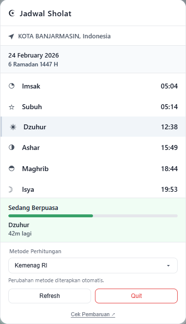
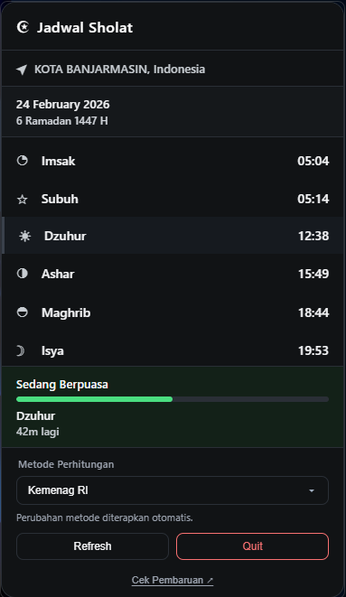

# Jadwal Sholat Widget

A lightweight desktop tray widget for daily prayer times.

[](https://github.com/mannnrachman/jadwal-sholat/releases/latest)


## Preview

<div align="center">
  
  &nbsp;&nbsp;&nbsp;&nbsp;
  
</div>

## Features

- Real-time prayer schedule: Imsak, Fajr, Dhuhr, Asr, Maghrib, Isha
- Countdown to the next prayer time
- Fasting status with progress bar (Fajr → Maghrib)
- Notifications with adhan sound
- Fast city search (Indonesia)
- Adaptive tray icon for light/dark theme

## API Sources

- Primary prayer times (Indonesia / Kemenag-based): [myQuran API v3](https://api.myquran.com/)
- Hijri date + fallback prayer times: [Aladhan API](https://aladhan.com/prayer-times-api)
- IP geolocation: [ipapi.co](https://ipapi.co) with fallback [ip-api.com](http://ip-api.com)

## Download

Get the latest release from [Releases](https://github.com/mannnrachman/jadwal-sholat/releases/latest):

- Windows: `.msi` / `.exe`
- macOS: `.dmg`
- Linux: `.deb` / `.AppImage`

## Development

```bash
git clone https://github.com/mannnrachman/jadwal-sholat.git
cd jadwal-sholat
npm install
npm run tauri dev
```

Build production:

```bash
npm run tauri build
```

## License

[MIT](LICENSE)
